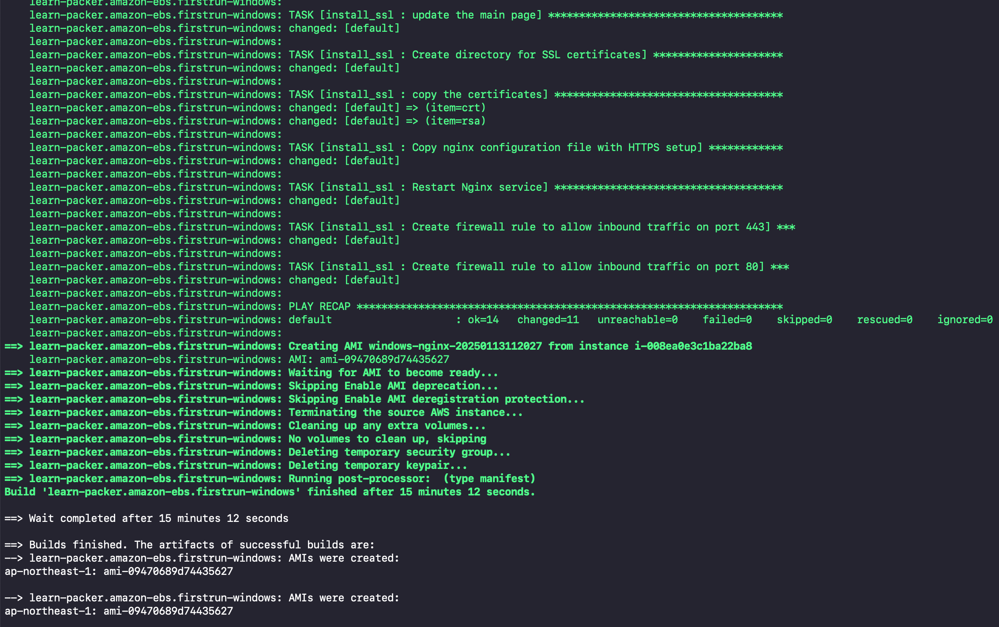

# AWS Nginx Service Deployment

## Architecture


This project implements an AWS-based Nginx service deployment using two distinct approaches (illustrated as red and green processes in the diagram above). The implementation consists of two main stages:

### 1. Platform Stage

The Platform stage focuses on creating custom AMIs using HashiCorp Packer. Key features include:

- Support for both on-demand EC2 and Spot Fleet instances during image building
- Flexible provisioning using Ansible (both local and remote configurations)
- Separate build processes for Linux and Windows environments

Code Description:

1. The `platform` directory contains `generate_certificates` which is used to generate SSL certificates.
2. The `platform-xxx` directories are used to build AMIs (Amazon Machine Images). Each directory contains build files with `.json` or `.hcl` extensions, which include shell/PowerShell scripts and Ansible playbooks for AMI configuration.

### 2. Deployment Stage

The Deployment stage uses HashiCorp Terraform to provision AWS resources with:

- Workspace-based environment management
- Infrastructure as Code (IaC) approach
- Support for multiple deployment configurations

Code Description:

1. The `deployment` folder contains scripts to create common AWS resources such as IAM profiles, ACM certificates, keypairs, and other shared components.
2. Each `platform` folder contains configurations to provision AWS resources using the newly built AMIs.

## Prerequisites

Before getting started, ensure you have the following tools installed:

- Packer
- Ansible
- Terraform
- AWS account with basic resources (e.g., default VPC)

## Implementation Guide

### 1. SSL Certificate Generation

First, generate SSL certificates for both Linux and Windows platforms.

**Note:** In production environments, certificates should be managed through a central system like CMDB or AWS Secrets Manager.

```shell
cd platform/generate_certificates
# create and configure the certificate_info_variable.yaml file for certificate information
ansible-playbook generate_certificate.yml  -e "@certificate_info_variable.yml"
```


### 2. Image Building

### Linux Image

```shell
cd platform/platform-linux

# Initialize and install required plugins

packer plugins install github.com/hashicorp/amazon
packer plugins install github.com/hashicorp/ansible

# alternatively, you can convert the json file to HCL using packer hcl2_upgrade -with-annotations nginx.json and initialize the plugin using packer init .

# configure the variables like the credentials, vpc_id and subnets.etc.
# refer to the variables.json file

# Validate the configuration before building
packer validate -var-file=variables.json  nginx.json

# Build the image
packer build -var-file=variables.json nginx.json
```


### Windows Image

The Windows build process differs from Linux in the following ways:

- Uses WinRM for communication
- Executes Ansible from the host server
- Utilizes spot instances for cost optimization

```shell
cd platform-windows
export AWS_ACCESS_KEY_ID="YOUR_ACCESS_KEY"
export AWS_SECRET_ACCESS_KEY="YOUR_SECRET_KEY"
packer init .
packer build windows.pkr.hcl
```




### 3. Deployment

The deployment process uses Terraform workspaces to manage different environments. The process includes:

#### Base Infrastructure

1. ACM certificate creation for SSL/TLS
2. EC2 instance profile configuration
3. SSH key pair generation

#### Linux Deployment

Update the AMI ID in `linux.tfvars` with the ID generated during the platform build stage.

```shell
terraform init
terraform workspace new linux
terraform plan -var-file="linux.tfvars" -out linux.plan
terraform apply "linux.plan"
```

For detailed Linux deployment screenshots and verification steps, refer to [Linux Deployment Guide](docs/LINUX_DEPLOYMENT.md).

#### Windows Deployment

```shell
terraform init  # If not already initialized
terraform workspace new windows
terraform plan -var-file="windows.tfvars" -out windows.plan
terraform apply windows.plan
```

For detailed Windows deployment screenshots and verification steps, refer to [Windows Deployment Guide](docs/WINDOWS_DEPLOYMENT.md).
