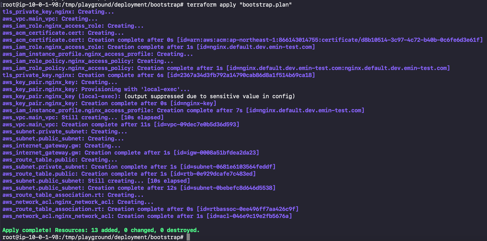
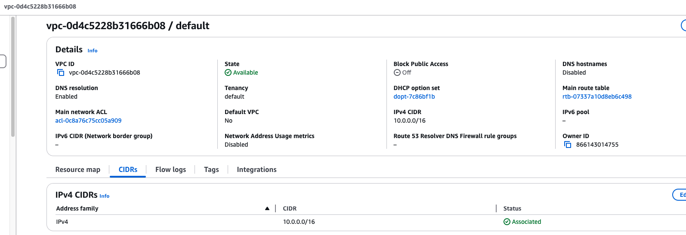
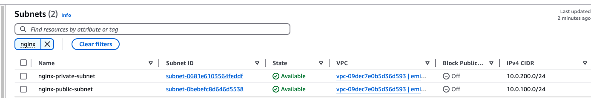

# Bootstrap Deployment Guide

## Deployment Process and Verification

### 1. Infrastructure Deployment

The terraform deployment process creates all necessary AWS resources:


_Successful completion of resource deployment_

### 2. Resource Verification


_VPC setup and configuration details_


_Subnet setup and configuration details_

## Cleanup

To destroy the infrastructure when no longer needed:

```shell
terraform workspace select bootstrap
terraform destroy -var-file=terraform.tfvars  -var-file="bootstrap.tfvars"
```
