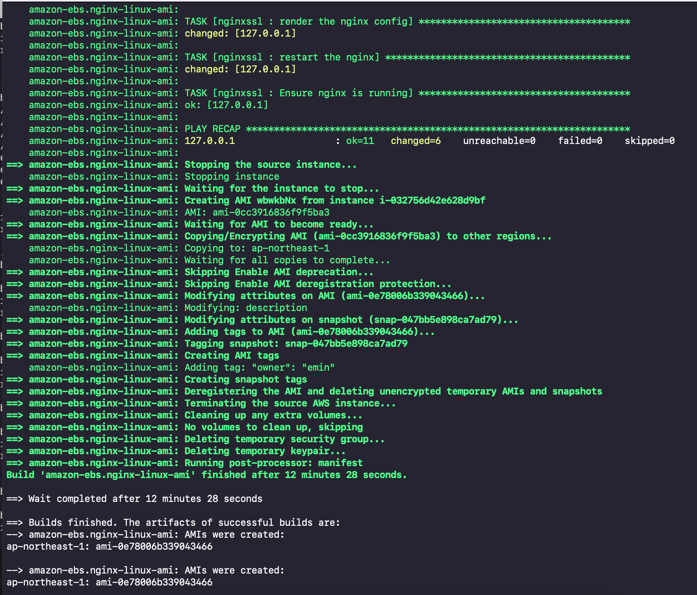
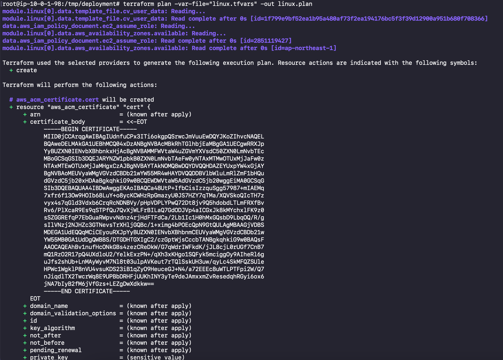
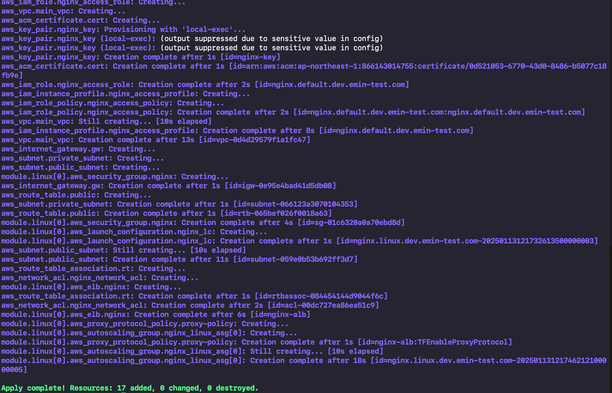
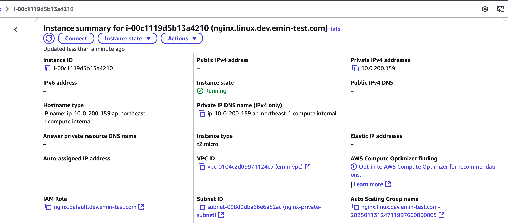
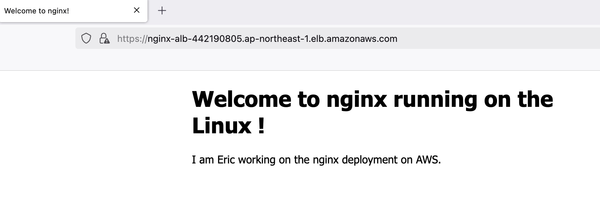

# Linux Deployment Guide

## Build Process

The process starts with building the custom AMI:


_Initial build phase of the Linux AMI_


_Successful completion of AMI creation_

## Deployment Process and Verification

### 1. Infrastructure Deployment

The terraform deployment process creates all necessary AWS resources:


_Terraform applying the infrastructure changes_


_Successful completion of resource deployment_

### 2. Resource Verification

#### EC2 Instance


_Verification of running Linux EC2 instance with correct configurations_

#### Application Load Balancer


_ALB setup and configuration details_


_ALB listener and target group verification_

### 3. Application Verification

#### SSL Certificate


_Verification of SSL certificate installation and HTTPS functionality_

#### Web Application


_Successful deployment of Nginx web application_

## Cleanup

To destroy the infrastructure when no longer needed:

```shell
terraform workspace select linux
terraform destroy -var-file=linux.tfvars
```
