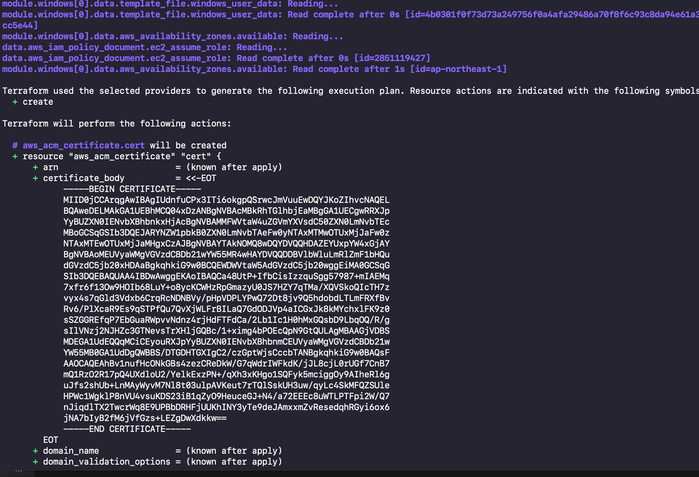
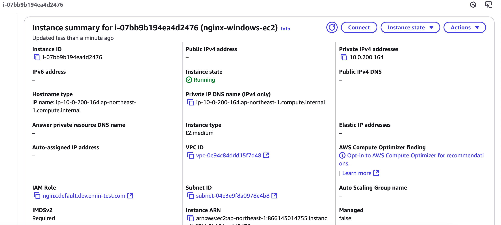
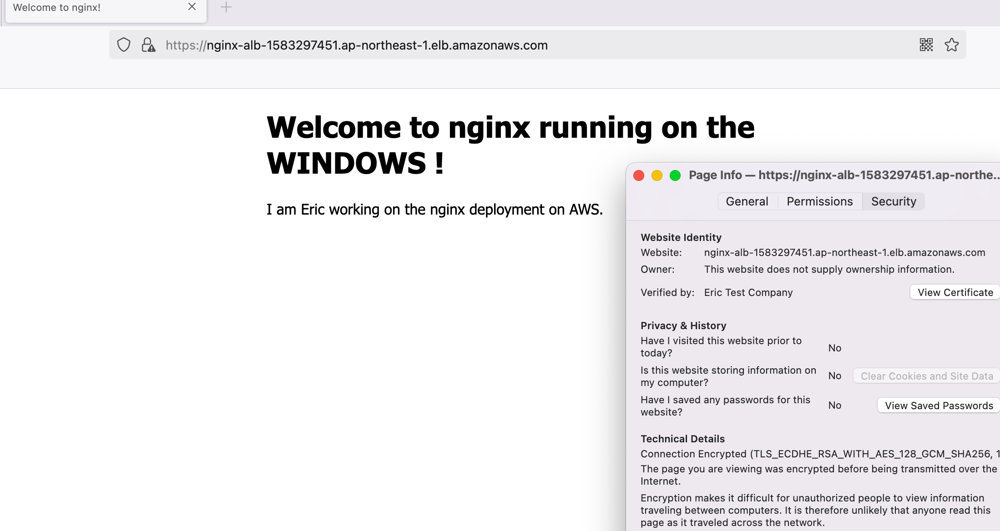

# Windows Deployment Guide

## Deployment Process and Verification

### 1. Infrastructure Deployment

The terraform deployment process creates all necessary AWS resources:


_Terraform applying the infrastructure changes_


_Successful completion of resource deployment_

### 2. Resource Verification

#### EC2 Instance


_Verification of running Windows EC2 instance with correct configurations_

#### Application Load Balancer


_ALB setup with proper target group and listener configurations_

#### Target Group Health


_Target group showing healthy instance status with proper health checks_

Key points to verify in target group:

- Instance is registered and healthy
- Health check is passing
- Correct port (443) is configured
- Protocol is set to HTTPS
- VPC and security group settings are correct

### 3. Deployment Verification

After successful deployment, you should see the nginx welcome page running on Windows:


_Nginx successfully running on Windows with HTTPS enabled_

Key points to verify:

- HTTPS connection is secure
- Domain resolves correctly to the ALB endpoint
- Nginx welcome page loads properly

## Cleanup

To destroy the infrastructure when no longer needed:

```shell
terraform workspace select windows
terraform destroy -var-file=windows.tfvars
```
